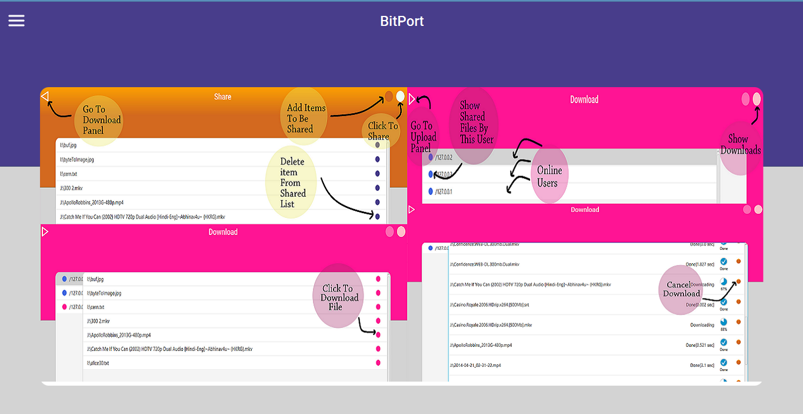

# BitPort
File Share application with ability to list all online instances without explicitly specifying IP address for individual instances.

### Home Page

### Share Files

### Download files shared by other users
 

### Files uploaded, i.e. files which are shared by this user and actively downloaded by remote user
 
